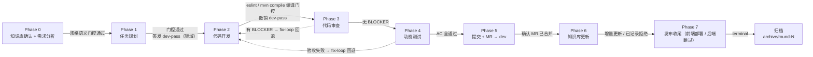
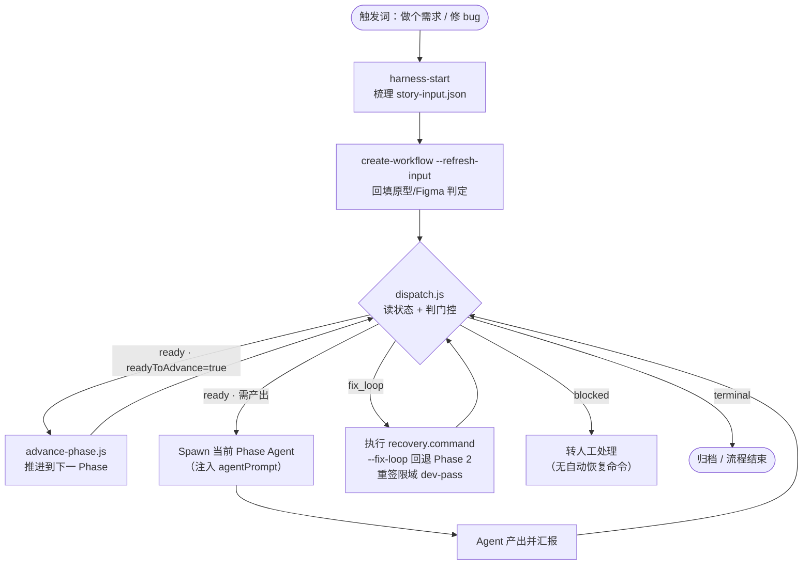

# FullstackFlow

**全栈研发自动化工作流插件市场。** 整合规格驱动方法论与
[open-code-review](https://github.com/alibaba/open-code-review) 审查规则集（Apache-2.0）、
[OpenSpec](https://github.com/Fission-AI/OpenSpec) 规格规范（MIT）。

安装 **FullstackFlow** 插件后，你的 AI 编程助手（Claude Code / CodeBuddy Code）获得一条
门控式全流程研发流水线：需求分析 → 任务规划 → 全栈开发 → 代码审查 → 功能测试 →
Git/MR → 知识库更新 → 发布收尾 → 归档。用 `/fsflow:run` 一条命令拉起全流程，
也可以直接对 AI 说自然语言触发词。

> 兼容 Claude Code 与 CodeBuddy Code，安装步骤完全一致。
> 市场清单分别位于 `.claude-plugin/marketplace.json` 与 `.codebuddy-plugin/marketplace.json`，内容一致。
> 当前版本 **1.3.0**。

## 目录

- [核心特性](#核心特性)
- [环境要求](#环境要求)
- [安装](#安装)
- [快速上手](#快速上手)
- [常用命令](#常用命令)
- [最佳实践](#最佳实践)
- [6 个角色 Agent](#6-个角色-agent)
- [12 个 Skill](#12-个-skill)
- [Hook 安全护栏](#hook-安全护栏)
- [零外部依赖设计](#零外部依赖设计)
- [故障排除与卸载](#故障排除与卸载)
- [仓库结构](#仓库结构)

## 核心特性

### 1. 端到端 8 Phase 工作流

触发词驱动完整研发链路，每个 Phase 有明确的 Agent 分工、产出物与门控校验：

| Phase | 阶段 | 负责 Agent | 关键产出物 |
|---|---|---|---|
| 0 | 知识库前置确认 + 需求分析 | 需求分析师 | 缺库时经用户确认后全量生成或留痕拒绝；requirement-analysis.md、内嵌 OpenSpec 语义的 acceptance-criteria.json |
| 1 | 任务规划 | 任务规划师 | task-dag.json（DB→后端→前端→集成 DAG）、Figma 组件绑定 |
| 2 | 代码开发 | 全栈开发工程师 | 代码变更（dev-pass 限域保护） |
| 3 | 代码审查 | 代码审查师 | code-review.json（前端人工 + 后端内置规则库） |
| 4 | 功能测试 | 测试工程师 | test-report.md、acceptance-verification.json |
| 5 | Git 提交 + MR | 发布助手 | 提交开发分支 + 创建 MR（→ dev）+ 确认已合并（三点用户确认） |
| 6 | 知识库增量更新 | 发布助手 | 已有知识库时增量更新；缺库时留痕跳过，不再确认初始化 |
| 7 | 发布收尾 | 发布助手 | 前端：devops MCP 云端构建 + 部署 URL；后端：确认合并即收尾 |

#### 8 Phase 横向流转



#### 主控循环（dispatch.js 四态调度）



> **核心设计：AI 不操作状态，只机械执行。** `dispatch.js` 是「只读调度器」——读状态、判门控、
> 说下一步，零写权限；`advance-phase.js` 是「相位跃迁唯一执行者」——判门控、写状态、
> 签发/撤销 dev-pass；主 Agent 无判断权，只按 `status` 四态（ready / fix_loop / blocked /
> terminal）机械分支。

### 2. 契约驱动 + 硬门控

工作流不是「口头约定」，而是**结构化契约 + 程序化门控**：

- 每个 Phase 推进前，产出物按 JSON Schema 程序化校验（内置 ajv，缺文件 / 格式错直接拦截）
- 验收标准（AC）与任务（Task）交叉引用校验，杜绝「AC 全绿但功能缺失」
- Phase 2→3 按仓库类型自动跑**前端 eslint 或后端 mvn compile / gradle compileJava**，
  编译错误不再漏到云端构建才暴露
- OpenSpec 的 Capability、增量类型、规范性 Requirement、Given/When/Then Scenario 直接内嵌到 AC，并由 Phase 0 门控强制校验；不生成重复的 `openspec/` 文件树

### 3. 权限控制（dev-pass）

AI 修改源码受 dev-pass 通行证约束：仅在开发阶段由脚本自动签发、限域到 `task-dag.json`
的任务文件清单，阶段结束自动撤销；未授权文件的写入会被 PreToolUse hook 直接拦截——
杜绝 AI 越权改动未授权文件。

### 4. 知识库（KB）管理

- `kb-init` 初始化项目知识库（自动推断项目画像与业务域，支持前端 / 后端 / 插件仓）
- `kb-query` 分层检索（L1 域定位 → L2 精确筛选 → L3 按需加载；需求分析 / 改代码前自动注入）
- `kb-update` 增量更新（git diff 数据驱动定位受影响域，保留手工批注）
- 所有知识库文档统一收纳到项目 `.docs/llm-knowledge/`，禁止散落到项目根 / `docs/`

### 5. 发布安全

铁律——Git 提交 / push / 创建 MR 三点均强制用户确认（AskUserQuestion）；
后端项目跳过云端部署，确认合并即收尾。

## 环境要求

| 依赖 | 要求 | 说明 |
|---|---|---|
| 宿主 | Claude Code 或 CodeBuddy Code | 两者安装步骤完全一致 |
| Node.js | ≥ 16（推荐 18+） | 唯一运行时，所有门控 / 归档 / 校验脚本用 node 执行 |
| Git | ≥ 2.20 | Phase 5 提交流程与 kb-update 增量检测依赖 |

> 无需安装 openspec CLI、无需 npm install、无需配置额外 LLM Key——见[零外部依赖设计](#零外部依赖设计)。

## 安装

```
/plugin marketplace add AbyssPan/fullstackflow
/plugin install fsflow@fullstackflow-marketplace
```

添加市场不会自动安装插件，必须继续执行第二条命令。安装后用 `/plugin list` 确认包含
`fsflow`，随后输入 `/fsflow:` 应能看到命令提示（冒烟测试详见
[INSTALL.md](./INSTALL.md)）。

> **安装前检查、冒烟测试、ajv 依赖排查、卸载等完整步骤请参阅 [INSTALL.md](./INSTALL.md)**。

## 快速上手

### 方式一：斜杠命令（推荐）

插件命令会按宿主规范自动加 `fsflow:` 命名空间，常用姿势：

```
/fsflow:run "开发订单中心退款功能"       # 新功能：AI 自动建 Story 并进入 run 模式
/fsflow:fixbugs "订单列表页白屏"         # 缺陷修复：免原型文档
/fsflow:status                           # 查看当前工作流状态
```

`run` 和 `fixbugs` 分开后，常用场景无需再做模式猜测。兼容入口
`/fsflow:fullstack` 仍会自动识别意图；信号不足时只询问一次。

### 方式二：自然语言触发词

对 AI 助手直接说触发词，效果等同：

| 想做什么 | 怎么说 |
|---|---|
| 开发一个新功能 | 「做个需求 / 开发 xx 功能 / 实现 xx 页面」 |
| 修 Bug / 处理 TAPD 缺陷 | 「修个 bug / 处理 TAPD 缺陷 / xx 功能报错」 |
| 初始化项目知识库 | 「初始化知识库 / kb-init」 |
| 生成 / 更新知识库文档 | 「生成知识库文档 / 增量更新知识库」 |
| 生成 API 请求层代码 | 提供 Swagger JSON / api doc，「按模块生成接口定义」 |
| 归档已完成的 Story | 「归档本次需求」 |

> 首次启动 `run` / `fixbugs` 时，需求分析师会先检查知识库；缺失时询问是否初始化并全量生成，
> 无需另行启动初始化流程。

## 常用命令

| 命令 | 说明 |
|---|---|
| `/fsflow:run [storyId] "<需求描述>"` | 执行端到端新功能开发（8 Phase，含原型 / Figma 门控） |
| `/fsflow:fixbugs [storyId] "<缺陷描述>"` | 根因分析并修复缺陷（免原型门控；可在描述中附 TAPD 信息） |
| `/fsflow:status` | 查看当前 Story、Phase 与门控状态 |
| `/fsflow:end` | 结束当前激活会话并解除源码编辑门控，不归档 Story |
| `/fsflow:evolve [storyId\|all] [--check-only\|--propose-only]` | 运行自进化体检（audit → 度量 → 诊断 → 治疗 → 验证） |
| `/fsflow:archive <storyId> <archive\|restore\|list\|status> [options]` | 归档、复档或查看归档历史；不会在缺少动作时默认归档 |

> `<storyId>` 可省略，由 AI 根据描述生成。旧的统一形式可继续使用
> `/fsflow:fullstack <run|fixbugs|status|end|evolve|archive> ...`。

## 最佳实践

### 1. 工作流初始化
- **入口先写 `story-input.json`，再用 `harness-workflow.js start --input <file>` 一步建流**。脚本会在任何状态写入前校验输入并一次算准原型 / Figma 门控；`--refresh-input` 只用于旧流程或输入后补的恢复场景。
- **`story-input.json` 只搬运参数、不做分析**。把用户给的链接 / 终端 / 描述原样写入即可；判断需求影响哪些文件、该怎么改，归 Phase 0 需求分析师。
- **功能测试默认先询问**。新工作流未写 `verificationMode` 或写 `ask` 时，代码审查通过后主动询问是否执行独立测试，未回答则等待。
  用户选择测试后执行 Phase 4；选择跳过则记为 `skipped` 并继续交付。此前已明确选择时，入口写 `full` / `review-only`，恢复会话和修复回路不重复询问。
  旧工作流保留原有配置；旧状态未含该字段时仍按 `full` 执行。跳过独立测试不改变代码审查和项目原有检查配置。

### 2. 状态文件纪律（铁律）
- 🚫 **AI 不手改 `e2e-state.json` / `dev-pass.json`**。Phase 推进、dev-pass 签发/撤销全部由脚本完成，AI 只按 `dispatch.js` 的四态（ready / fix_loop / blocked / terminal）机械分支。
- 🚫 **AI 不自行将 `open-questions.json` 的 `resolved` 设为 `true`**。待确认项必须由用户确认。
- 🚫 **Phase ≠ 2 时不要编辑 `src/`**，Hook 守卫会直接拒绝。

### 3. Figma 使用
- `sources.figmaUrls` 非空即**自动开启硬门控**（run 模式），强制产出 `figma-frame-inventory.json` 与组件映射，UI 任务的 `figmaNodeId` 必须命中 frame 清单。
- **前置条件：Figma 桌面端需运行并已打开文件**。未运行时子 Agent 会如实告知并停止，不会退回缓存数据。
- `fixbugs` 模式不开硬门控（只碰个别页面，全量清单会卡死修复流程），但「有设计稿就该解析」的指引仍会注入。

### 4. run vs fixbugs 模式选择
- **新功能 / 页面级改造** → `run`（有原型 / Figma 门控、featurePoints 功能点枚举）
- **缺陷修复** → `fixbugs`（免原型文档、Phase 0 产出 Bug 分析报告、后端类 Bug 自动转 open-questions）
- 选错模式的后果：`fixbugs` 误走 run 会重新要求原型文档且不做 Bug 报告门控。

### 5. 修复回路（fix-loop）
- 审查/测试发现 BLOCKER 或验收失败时，工作流自动回退到 Phase 2 修复，重新签发限域 dev-pass。
- **默认最多 2 轮**，超出后转人工介入，不让 AI 无限重试空转。

### 6. 知识库（KB）
- 新项目在 Phase 0 需求分析开始时确认：用户同意后由 `kb-init` + `gen-project-docs` 完成初始化与全量生成。
- 需求分析 / 改代码前用 `kb-query` 分层检索，历史教训自动注入各 Phase 的 prompt。
- 任务完成后 `kb-update` 增量同步，保留手工批注。

### 7. 多项目协作
- 涉及多仓库时，需求分析师在 Phase 0 写入 story 级 `repos.json`（`primary` + `repos` 映射）。
- 跨项目 task 的 `description` 必须含行号引用，便于全栈开发工程师定位改动点。

## 6 个角色 Agent

| Agent | 注册名 | 职责要点 |
|---|---|---|
| 需求分析师 | `requirement-analyst` | Grill 四阶段结构化面试（目标对齐→架构决策→边界与风险→实现细节），产出内嵌 OpenSpec 语义的验收契约 |
| 任务规划师 | `task-planner` | 任务 DAG（DB→后端→前端→集成），有 Figma 设计稿时逐 UI 任务绑定 figmaRefs |
| 全栈开发工程师 | `fullstack-developer` | 前端 / 后端 / DB 贯通实现——分层架构、类型化 VO、DTO 校验、事务并发、SQL 规范 |
| 代码审查师 | `code-reviewer` | 前端人工审查 + 后端内置规则库审查（零外部依赖）+ 项目规范复核（分层 / 事务 / SQL / 前后端契约一致性） |
| 测试工程师 | `test-engineer` | 前端 Playwright 实跑 + 后端三层验证（接口契约真实请求 / mvn test 业务逻辑 / 只读 SELECT 数据落库） |
| 发布助手 | `release-assistant` | Git 提交 / push / 创建 MR 三点强制用户确认；KB 增量更新；前端走 devops MCP 云端构建，后端跳过云端部署确认合并即收尾 |

各 Agent 在 frontmatter 中声明推荐模型，便于宿主按角色能力与成本路由：

| Agent | 模型 |
|---|---|
| 需求分析师 | `deepseek-v4.1-flash` |
| 任务规划师 | `deepseek-v4-pro` |
| 全栈开发工程师 | `GLM-5.3` |
| 代码审查师 | `hy4-preview` |
| 测试工程师 | `hy4-preview` |
| 发布助手 | `hy3` |

## 12 个 Skill

**工作流编排（4 个）**

| Skill | 用途 |
|---|---|
| `harness-start` | 统一入口：识别意图（新功能 run / Bug 修复 fixbugs），梳理 story-input.json 并启动工作流 |
| `harness-conductor` | 工作流编排器：调度 Agent、管理 Phase 推进、错误恢复决策；Phase 门控详情与脚本 API 在 references/ 按需读取 |
| `harness-evolve` | 自进化闭环：体检(audit) → 度量(metrics) → 诊断(mining) → 治疗(proposal) → 验证(validation) |
| `harness-archive` | Story 归档 / 复档恢复 / 归档历史查看，归档后 root 目录清空 |

**知识库（4 个）**

| Skill | 用途 |
|---|---|
| `kb-init` | 初始化知识库骨架：自动推断项目画像（project_type / source_root，支持前端 / 后端 / 插件仓），动态扫描真实业务域（不硬编码），生成 `.docs/llm-knowledge/` |
| `kb-query` | 渐进式三层检索：L1 overview 关键词定位域 → L2 meta.yaml 精确筛选 → L3 按需加载文档；支持需求拆解 / 技术方案 / 接口搜索 / 知识问答 4 种模式；与 graphify 双源交叉验证 |
| `kb-update` | Git 提交后增量更新：git diff 定位变更文件，meta.yaml 数据驱动映射受影响业务域（通配符匹配，不硬编码路径），保留手工批注 |
| `gen-project-docs` | 扫描源码生成结构化文档：通用 5 类 + 项目类型特有切面，支持全量 / 单域 / 增量模式与新鲜度检测 |

**开发规范（1 个）**

| Skill | 用途 |
|---|---|
| `backend-tech-spec` | 后端开发规范解析：已有项目优先知识库与工程约定，新项目或规范缺失处采用安全、现代的 Java / Spring Boot 默认基线 |

**辅助工具（3 个）**

| Skill | 用途 |
|---|---|
| `api-generator` | 由 Swagger JSON / api doc 按模块或接口路径生成接口定义、请求函数与 JSDoc 注释，不依赖固定业务目录 |
| `figma-to-component-map` | Phase 1 任务规划时产出 Figma frame 清单（figma-frame-inventory.json），为每个 UI 任务绑定精确 figmaRefs（nodeId + link） |
| `tapd-bug-analyzer` | 从 TAPD 拉取需求关联 bugs，按处理人过滤，逐条记录复现步骤 / 代码定位 / 根因 / 责任方，只采集事实不产出修复方案 |

## Hook 安全护栏

编辑类操作前置校验（PreToolUse），不合规的写入直接被拦截：

- **enforce-state-file.js** — 状态文件守卫：工作流进行中保护 e2e-state.json 等内部状态不被误改
- **enforce-dev-pass.js** — 开发门控：无有效 dev-pass 或写入超出限域文件清单时拦截源码编辑
- **enforce-artifact.js** — 产出物契约：按 Phase 检查必备产出物存在性
- **session-start.js / session-stop.js** — 会话恢复与清理：新会话自动恢复工作流状态，Stop 时落盘
- **trace-command.js** — 命令审计：记录命令 / Agent / Skill / MCP 调用轨迹，供 harness-evolve 度量分析

另有：`kb-query` 的 skill 描述直接声明自动触发场景（涉及业务模块、改代码、查实现等场景先查知识库）；`output-styles/harness.md` 提供表格化汇报、结构化 blocker 列表并禁止泄露内部状态文件路径。

## 零外部依赖设计

插件**无需安装任何 CLI、无需配置额外 LLM Key**，安装即用（node 即唯一运行时，
提供 6 个常用 slash command 与 1 个兼容统一入口）：

| 能力 | 实现方式 |
|---|---|
| OpenSpec 规格门控 | `policy.js` 在 Phase 0 强制校验 Why/Non-Goals/Decisions/Capabilities/Risks、规范性 Requirement 与 Given/When/Then；Phase 1 校验功能点→AC→Task 追踪链，无需独立 OpenSpec CLI 或文件目录 |
| 后端代码审查 | 内置规则库 `skills/harness-conductor/references/review-rules/`（default 五维度 / Java / TS·JS / Mapper XML，均含「不报告」防误报护栏），由审查师模型逐文件执行 |
| JSON Schema 校验 | 内置 `vendor/ajv.bundle.js`（免 npm install） |
| 发布前验证 | `npm run verify`：插件结构一致性检查 + 8 组回归测试（当前 293 项断言） |

可选增强（按需配置，不配置时各 agent 自动降级）：Figma MCP（设计稿拉取）、devops MCP（前端云端构建）、
GitLab MCP（MR 管理）、TAPD（需求/缺陷导入）、Playwright MCP（前端实跑测试）。

**graphify skill**（结构检索，与 kb-query 组成双源交叉验证）：不在本插件内，需单独安装到用户级
skills 目录；未安装时各 agent 自动降级为 kb-query 单源 + `search_content` 文本检索（policy 会记
debt 并在 Evo Score 扣分，不阻断流程）。

## 故障排除与卸载

### 常见问题

| 问题 | 解决方法 |
|---|---|
| 市场添加后无法加载 | 确认 GitHub 地址可访问，仓库根目录存在 `.claude-plugin/marketplace.json` / `.codebuddy-plugin/marketplace.json` |
| 安装时提示「路径未找到」 | 使用 Git 型市场（`https://...git`），不要用 URL 型 |
| 命令补全里找不到旧短入口 | 插件命令必须带命名空间，请输入 `/fsflow:`；重载插件（`/reload-plugins` 或重启宿主）后再试 |
| Skill 不响应触发词 | 用 `/plugin list` 确认已安装并启用，再执行 `/reload-plugins` 或重启宿主 |
| 报 `Cannot find module 'ajv'` | 确认 `plugins/fsflow/vendor/ajv.bundle.js` 存在，`git pull` 同步（**不要** `npm install`） |
| 报 `e2e-state.json 不存在` | 冷启动场景：先说「做个需求」走 harness-start 建流，或按 terminal 恢复命令执行 restore 复档 |
| dev-pass 拦截了源码编辑 | 正常行为——确认当前处于 Phase 2 且目标文件在 task-dag.json 的 `files[]` 限域内；开发未完成但 pass 过期用 `--renew-pass` 续签 |
| Story 目录被清空了 | 已归档：root 文件在 `archive/round-{N}/`，执行 restore 命令可完全复原 |

> 更多排障细节见 [INSTALL.md](./INSTALL.md)。

### 卸载

```
/plugin uninstall fsflow@fullstackflow-marketplace
/plugin marketplace remove fullstackflow-marketplace
```

项目侧残留（按需清理）：`.codebuddy/plans/`（Story 状态与归档）、`.docs/llm-knowledge/`（知识库文档）。

## 仓库结构

```
fullstackflow/
├── INSTALL.md                           # 安装 / 冒烟测试 / 排障 / 卸载完整指南
├── .codebuddy-plugin/marketplace.json   # CodeBuddy Code 市场清单
├── .claude-plugin/marketplace.json      # Claude Code 市场清单（内容一致）
└── plugins/
    └── fsflow/                          # 插件本体
        ├── .claude-plugin/plugin.json   # Claude Code 插件元信息
        ├── .codebuddy-plugin/plugin.json # CodeBuddy Code 插件元信息
        ├── plugin.json                  # 旧宿主兼容元信息
        ├── commands/                    # run/fixbugs/status/end/evolve/archive + 兼容统一入口
        ├── agents/                      # 6 个角色代理
        ├── skills/                      # 12 个技能（工作流 / 知识库 / 开发规范 / 辅助工具）
        ├── hooks/hooks.json             # 5 类安全护栏钩子
        ├── output-styles/harness.md     # 汇报输出风格
        ├── scripts/                     # dispatch / advance-phase / archive / policy 门控等
        ├── scripts/audit/plugin-check.js # manifest / 命令 / Skill / Hook 一致性检查
        ├── scripts/__tests__/           # 8 组回归测试（当前 293 项断言）
        └── vendor/ajv.bundle.js         # 内置 ajv（免 npm install）
```

## License

MIT
